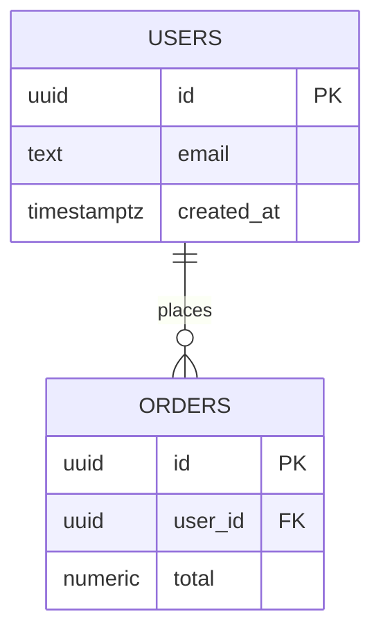

# DB-Schema Auto-Doc Convention — Design

**Date:** 2026-07-18
**Status:** APPROVED (design)
**Author:** brainstormed with user

## Purpose

A global, opt-in convention that keeps a living database-schema document in sync
with the code. For any repo that opts in, a single `DB-SCHEMA.md` holds a Mermaid
ER diagram, per-column purpose explanations, and a relations narrative. A `Stop`
hook nags Claude to regenerate the doc whenever schema-defining files change, and a
companion skill does the generation and semantic drift review.

Directly mirrors the existing spec-tree layer (`SPEC-TREE.md` + `spec-guard.js` +
`spec-sync` skill): global (lives in `~/.claude`), opt-in via a marker file,
self-disabling, fail-open, one-shot.

## Success criterion

In a repo containing a `DB-SCHEMA.md`, a turn that edits a schema-defining file but
does not update `DB-SCHEMA.md` is blocked on its first stop attempt with a message
naming the changed file. In a repo with no `DB-SCHEMA.md`, the hook is silent. The
`db-schema` skill can bootstrap the doc from schema sources and regenerate it on
demand.

## Decisions (locked)

| Decision | Choice |
|---|---|
| Scope | Global, opt-in — lives in `~/.claude`, mirrored to `BeMuCa/personal-claude-skill-collection` |
| Doc filename | `DB-SCHEMA.md` (hyphen-uppercase, matches `SPEC-TREE.md`) |
| Doc location | Root of the repo's dedicated DB folder (not necessarily repo root) |
| Doc count | One canonical `DB-SCHEMA.md` per repo |
| Toggle | Presence of `DB-SCHEMA.md` anywhere in the repo enables the convention |
| Trigger | Any schema-defining file change **anywhere** in the repo updates the one doc |
| Nag behavior | Match `spec-guard` exactly: block first stop, escape via "state why no update needed", second stop passes |
| Schema sources | SQL migrations / `*.sql`, ORM models in code, Alembic migration files |

## Component 1 — The doc: `DB-SCHEMA.md`

Format (defined canonically in the skill):

```markdown
---
status: CURRENT            # CURRENT | DRAFT | STALE
sources:                   # globs/paths the doc is generated from
  - db/migrations/**/*.sql
  - app/models/**/*.py
patterns: []               # optional per-repo override of hook trigger patterns
---

# Database Schema

## ER Diagram


## Tables

### users
Purpose: application accounts.

| column | type | purpose | notes |
|---|---|---|---|
| id | uuid | primary key | gen_random_uuid() |
| email | text | login identity | unique |
| created_at | timestamptz | signup time | |

### orders
...

## Relations
- `orders.user_id` → `users.id`: each order belongs to one user; users have many orders.
```

- **Mermaid `erDiagram`** — every table, columns with types + `PK`/`FK` markers, relationship edges with cardinality.
- **Per-table section** — one-line purpose, then a `column | type | purpose | notes` table.
- **Relations narrative** — FK relationships in prose (what references what, and why).

## Component 2 — The hook: `~/.claude/hooks/db-schema-guard.js`

`Stop` / `SubagentStop` hook, registered in `~/.claude/settings.json` alongside
`verify-gate` and (conceptually) `spec-guard`.

Logic:
1. Read transcript for the current turn (same turn-boundary detection as
   `spec-guard`: walk transcript backward, stop at first real user message).
2. Collect `Edit`/`Write`/`NotebookEdit` `file_path`s whose path matches an entry
   in `SCHEMA_PATTERNS` (editable array at top of file). Default patterns:
   - `*.sql`
   - path contains `/migrations/`
   - `*.prisma`
   - basename `models.py`, or path contains `/models/` and ends `.py`
   - Alembic `versions/*.py`
   - common ORM entity globs (`*.entity.ts`, drizzle `schema.ts`, `models.ts`)
3. If no schema files changed → return (silent).
4. Find repo root (walk to `.git`). Locate the one `DB-SCHEMA.md` via a bounded
   directory walk (skip `node_modules`, `.git`, `dist`, `build`, `.venv`, depth
   cap). None found → return silent (convention off — the smart toggle).
5. If `DB-SCHEMA.md` was itself edited this turn → return (already updated).
6. Otherwise emit `{ decision: "block", reason: ... }` naming the changed file(s)
   and instructing: regenerate `DB-SCHEMA.md` (mermaid + column purposes +
   relations) or state why no update is needed. Point to the `db-schema` skill for
   a full regen.

Guardrails (copied from `spec-guard`):
- `stop_hook_active` → return immediately (one-shot; second stop passes).
- Any exception → exit 0 (fail-open).
- **Accepted coverage gap:** schema changes made purely via Bash
  (`alembic revision --autogenerate`, `prisma migrate dev`) are not seen. Edited
  files are caught; pure-Bash generation is not. Documented, matches spec-guard.

## Component 3 — The skill: `~/.claude/skills/db-schema-sync/SKILL.md`

Skill dir and name both `db-schema-sync` (mirrors `spec-sync`). Does the judgment work the
mechanical hook cannot:
- **Bootstrap**: no `DB-SCHEMA.md` → read schema sources, generate the doc from
  scratch, place it at the DB folder root, set `sources` frontmatter.
- **Regenerate / sync**: re-read schema sources, rebuild the mermaid + column docs,
  report drift per table/column (ACCURATE | DRIFTED | ORPHANED with evidence),
  propose edits as diffs before applying.
- Owns the canonical doc format above.
- No `DB-SCHEMA.md` and user hasn't opted in → explain the convention and offer to
  bootstrap.

## Out of scope (YAGNI)

- No CLAUDE.md escalation-table row — hook + skill are self-contained.
- No live-DB-introspection mode (user's schemas are all file-based).
- No multi-DB / per-service doc splitting — one doc per repo; revisit if a monorepo
  needs it.
- No automatic mermaid rendering/validation — the doc is read as text/markdown.

## Final step

Mirror `hooks/db-schema-guard.js` and `skills/db-schema/` to the
`BeMuCa/personal-claude-skill-collection` github repo, per the model-discipline
layer sync rule.
